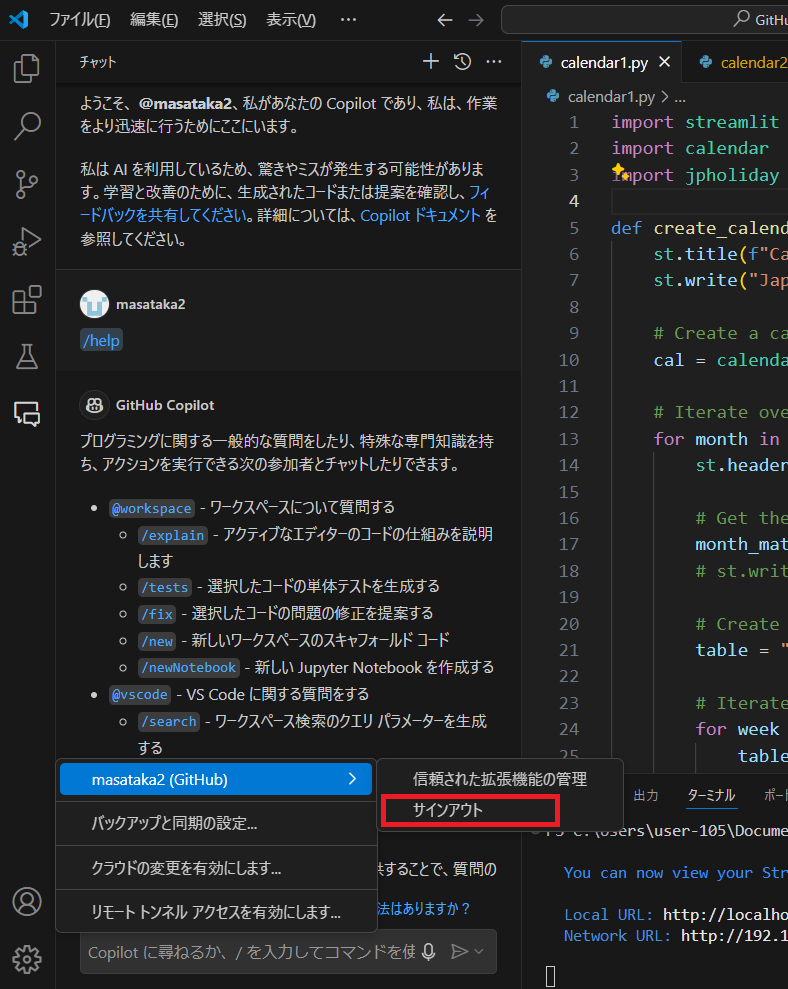
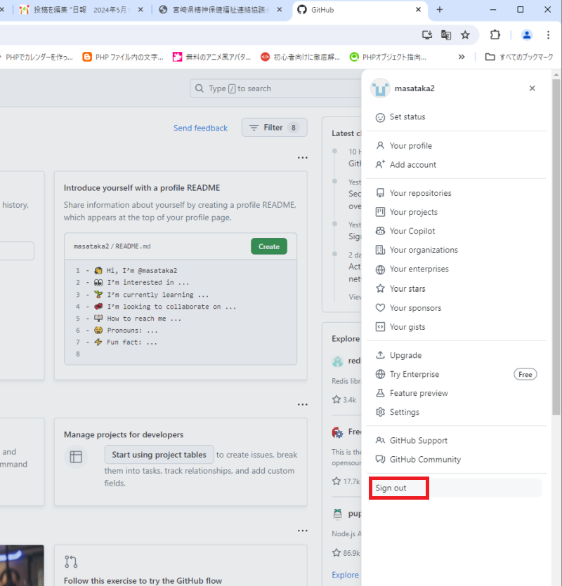
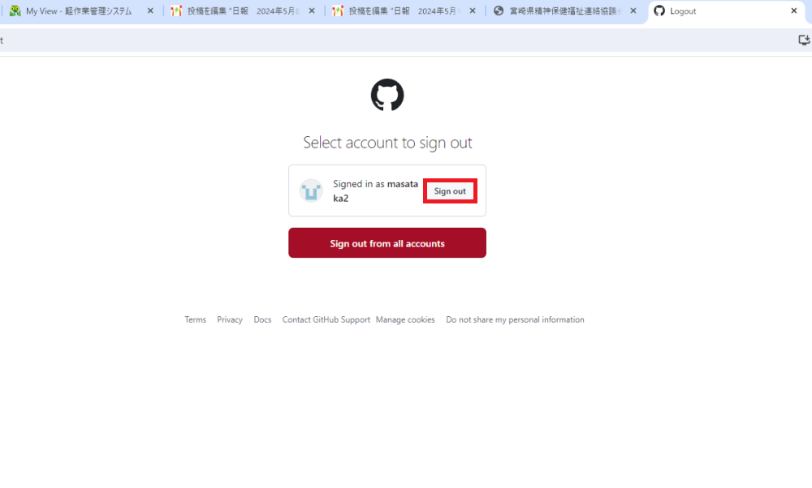
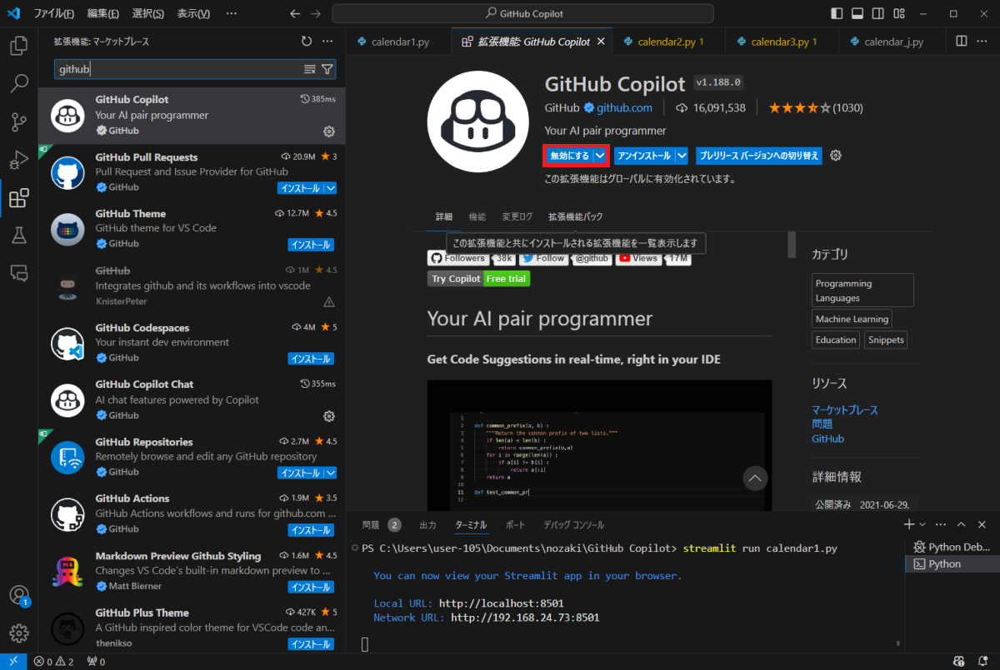
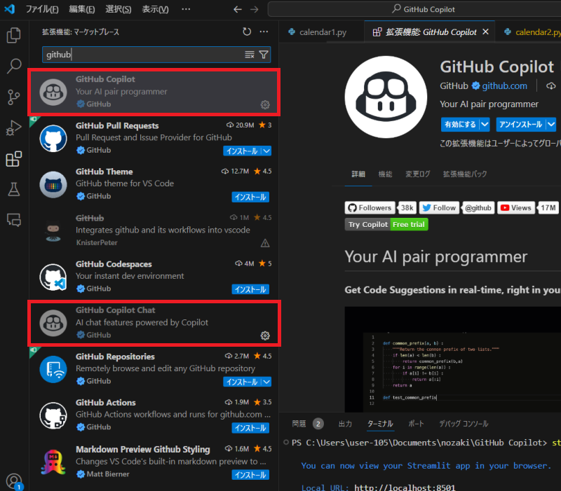

# Github CopilotをVS Codeで使う

## GitHub Copilotとは

GitHub Copilotは、GPT-4を使用したAIコーディング アシスタントで、コーディング作業を支援します。  
  
GitHub Copilotは様々なプログラミング言語に対応しています。得意とするプログラミング言語は、Python、JavaScript、TypeScript、Ruby、Go、C#、C++です。なおHTMLやCSSでも動作します。  
GitHub Copilotは、対応コードエディタに専用のプラグイン(拡張機能)をインストールすることで使えるようになります。  
GitHub Copilotが使えるコードエディタは、VS Code(Visual Studio Code)、Visual Studio、Neovim、JetBrainsなどです。  
  
今回は、VS CodeでGitHub Copilotを使う方法を解説します。  

## GitHub Copilotの料金

GitHub Copilotは有料のサブスクリプションサービスです。  
無料のトライアル期間が30日間あります(以前は60日間あった模様です)。個人向けの有料プランは、月額10ドルです。  
支払いには、クレジットカード、VISAデビットやPayPalを使用します。VISAデビット使用時は、トライアル開始時にいったん10ドルが決済されますが、直後に10ドルが返却されます。トライアル期間終了後に、あらためて10ドルが決済されて有料プラン開始となります。  

## 事前準備

事前にGitHubのアカウントを作成しておきます。  
GitHubのアカウント作成方法は以下のページを参考にしてください。  
<a href="https://qiita.com/Baru_Try/items/e80a765919a35a3c28c7" target="_blank">https://qiita.com/Baru_Try/items/e80a765919a35a3c28c7</a>

## GitHub Copilotの使い方

GitHub Copilotの登録方法や使い方については以下のページを参考にしてください。  
<a href="https://www.kagoya.jp/howto/it-glossary/develop/githubcopilot/#GitHub_Copilot-4" target="_blank">https://www.kagoya.jp/howto/it-glossary/develop/githubcopilot/#GitHub_Copilot-4</a>
- GitHub Copilotの登録方法
- コードエディタに専用プラグインをインストールする
- GitHub Copilotの機能を試してみる
- 【参考】GitHub Copilotのプランをキャンセルしたい場合
が記載されています。

GitHub Copilotでできることについては、同梱のファイル  
<a href="./GitHub_Copilotでできること一挙ご紹介.pdf" target="_blank">GitHub_Copilotでできること一挙ご紹介.pdf</a>  
を参照してください。

## 共用PCで使用時のTips

### GitHubからサインアウトする

作業終了時には、VS Code上でGitHubからサインアウトをしておきます。

また、ブラウザ上でもGituHubからサインアウトしておきます。

1. WebブラウザにてGitHubサイトにアクセスし、管理画面右サイドメニューから[Sign out]をクリックします。  

2. Sign out画面が表示されますので、[Sign out]もしくは、[Sign out from all accounts]をクリックするとサインアウトが完了します。  

### 拡張機能を無効にする

1. 他の方がVS Codeをさわる可能性がある場合は、VS Codeにインストールされている「GitHub Copilot」拡張機能を無効に設定しておきます。  

2. GitHub Copilot、GitHub Copilot Chatがグレーアウト(無効になっている)している事を確認します。

